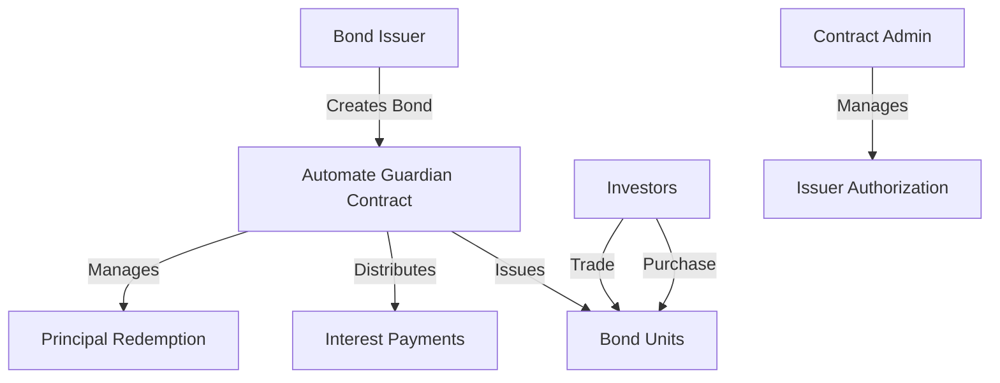

# Automate Guardian: Decentralized Bond Management Platform

Automate Guardian is an advanced smart contract platform for managing digital bonds on the Stacks blockchain, providing comprehensive bond lifecycle automation and seamless investor interactions.

## Overview

Automate Guardian revolutionizes bond management by offering:

- **Full Lifecycle Automation**: From issuance to maturity
- **Customizable Bond Parameters**: Flexible interest rates, payment schedules
- **Secure Trading Infrastructure**: Primary and secondary market capabilities
- **Transparent Governance**: Immutable ownership and transaction records



## Key Features

- Programmable bond issuance
- Automated interest distribution
- Flexible redemption mechanisms
- Comprehensive access controls
- Transparent financial operations

## Installation

### Prerequisites
- Clarinet
- Stacks Wallet
- STX tokens for transactions

### Quick Setup
```bash
clarinet console
```

## Usage Examples

1. Bond Issuance
```clarity
(contract-call? .bond-guardian create-bond
    u1000000000  ;; Total face value
    u1000000     ;; Denomination
    u500         ;; 5% Interest rate
    u144         ;; Payment frequency
    u52560       ;; Maturity blocks
    false        ;; Early redemption flag
)
```

2. Purchasing Bonds
```clarity
(contract-call? .bond-guardian purchase-bonds
    u1           ;; Bond ID
    u5           ;; Units
    none         ;; Optional recipient
)
```

## Security Considerations

- Rigorous input validation
- Access control for administrative functions
- Comprehensive balance checks
- Immutable transaction records

## Development

### Testing
```bash
clarinet test
```

## Limitations & Considerations

- Fixed interest rates at issuance
- STX token-based transactions
- Predefined bond parameters

## Contributing

Contributions welcome! Please read our contribution guidelines before submitting pull requests.

## License

[Specify License]